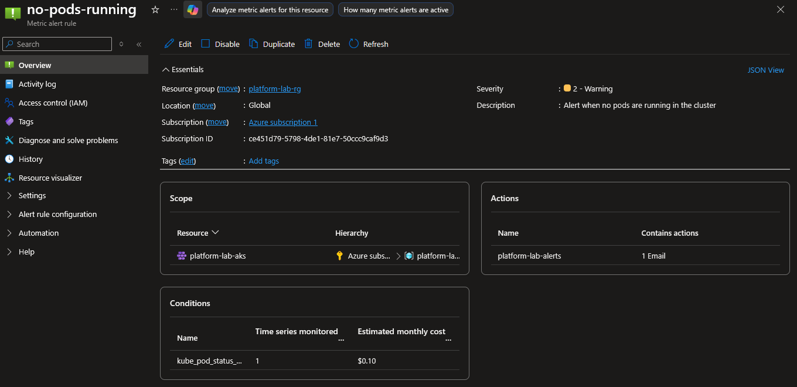
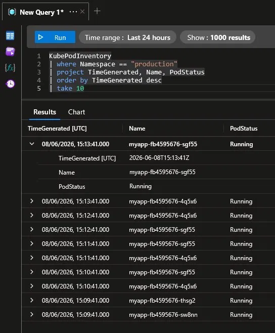
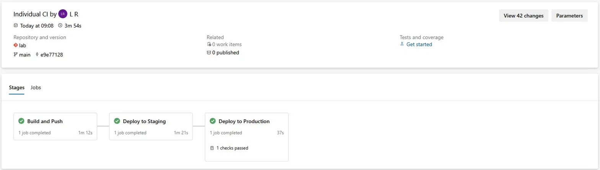
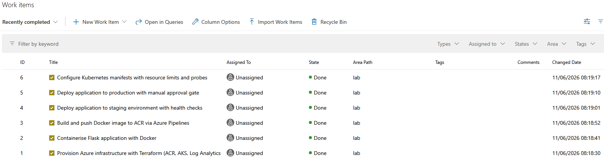
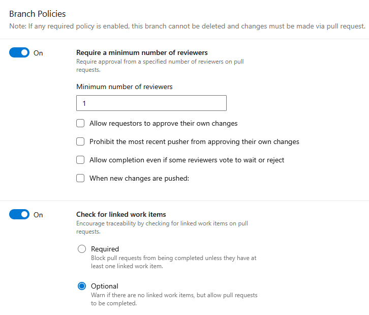
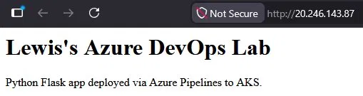

# Lab
Personal home lab built to get hands on with platform engineering concepts.

| [GitHub Actions Lab](#github-actions-lab) | [Azure DevOps Lab](#azure-devops-lab) |
|:---:|:---:|

---

## GitHub Actions Lab

Deploys a web app through a full staging and production pipeline on Azure Kubernetes Service. Infrastructure is provisioned with Terraform and authentication uses OIDC — no stored passwords anywhere.

---

### Pipeline

Push a change to main and this happens automatically:

1. Docker image built and pushed to Azure Container Registry
2. Deployed to staging namespace and health checked
3. Pipeline pauses for manual approval
4. Deployed to production namespace and health checked

<details>
<summary>Pipeline screenshots</summary>


</details>

---

### Infrastructure

Provisioned with Terraform — spin up with one command, tear down with one command.

Resources created:
- Resource Group
- Azure Container Registry
- AKS cluster
- AcrPull role assignment
- Log Analytics Workspace
- Azure Monitor metric alert

---

### Environments

Staging and production run as separate Kubernetes namespaces on the same cluster with their own public IPs.

| | Staging | Production |
|--|---------|------------|
| Replicas | 1 | 2 |
| Approval required | No | Yes |
| Resource limits | Yes | Yes |
| Liveness probe | Yes | Yes |
| Readiness probe | Yes | Yes |

<details>
<summary>Environment screenshots</summary>


</details>

---

### Monitoring

Azure Monitor and Log Analytics provisioned via Terraform. Pod status is queryable via KQL. A metric alert fires if pod count drops to zero and sends an email notification.

<details>
<summary>Monitoring screenshots</summary>




</details>

---

### Live app

<details>
<summary>App screenshots</summary>


</details>

---

### Auth

Uses OIDC — GitHub and Azure trust each other directly via federated credentials. No passwords, nothing to rotate or expire.

Secrets needed:
- `ACR_LOGIN_SERVER`
- `AZURE_CLIENT_ID`
- `AZURE_TENANT_ID`
- `AZURE_SUBSCRIPTION_ID`

<details>
<summary>Auth screenshots</summary>


</details>

---

### Files

| File | What it does |
|------|-------------|
| `index.html` | The app |
| `Dockerfile` | Builds the image |
| `k8s/staging.yaml` | Kubernetes config for staging — 1 replica, resource limits, probes |
| `k8s/production.yaml` | Kubernetes config for production — 2 replicas, resource limits, probes |
| `.github/workflows/deploy.yml` | Pipeline |
| `terraform/main.tf` | Azure infrastructure including monitoring |
| `scripts/health-check.sh` | Post-deploy health check — environment aware |

---

### Spin up

```bash
git clone https://github.com/lwr27/lab.git
cd lab/terraform
terraform init
terraform apply
```

Push a change to `index.html` to trigger the pipeline.

<details>
<summary>Terraform apply</summary>


</details>

### Tear down

```bash
terraform destroy
```

<details>
<summary>Terraform destroy</summary>


</details>

---

---
&nbsp;
---

## Azure DevOps Lab

A separate self-contained lab using Azure DevOps tooling end to end — Azure Repos, Azure Pipelines, and Azure Boards. Deploys a Python Flask app to AKS using the same infrastructure pattern as the GitHub lab but built entirely within the Azure DevOps ecosystem.

---

### What's different

| | GitHub Actions Lab | Azure DevOps Lab |
|--|-------------------|-----------------|
| Source control | GitHub | Azure Repos |
| Pipeline | GitHub Actions | Azure Pipelines |
| App | Static HTML | Python Flask |
| Auth | OIDC via federated credentials | Workload Identity Federation (automatic) |
| Agile tooling | — | Azure Boards |

---

### Pipeline

Push to main triggers:

1. Docker image built and pushed to ACR using admin credentials
2. Deployed to staging namespace with health check
3. Pipeline pauses for manual approval gate on production environment
4. Deployed to production namespace with health check

<details>
<summary>Pipeline screenshots</summary>



</details>

---

### Infrastructure

Same Terraform pattern as the GitHub lab — separate resource group, ACR, AKS cluster, Log Analytics, and Azure Monitor alert. State stored locally.

Resources created:
- Resource Group (`devops-lab-rg`)
- Azure Container Registry (`devopslablwr27`)
- AKS cluster (`devops-lab-aks`)
- AcrPull role assignment
- Log Analytics Workspace
- Azure Monitor metric alert

---

### Environments

Staging and production as separate Kubernetes namespaces, same pattern as the GitHub lab.

| | Staging | Production |
|--|---------|------------|
| Replicas | 1 | 2 |
| Approval required | No | Yes |
| Resource limits | Yes | Yes |
| Liveness probe | Yes | Yes |
| Readiness probe | Yes | Yes |

---

### Agile

Work items tracked in Azure Boards throughout the build.

<details>
<summary>Azure Boards</summary>



</details>

---

### Branch protection

Main branch protected with branch policies — requires reviewer approval before merge.

<details>
<summary>Branch policies</summary>



</details>

---

### Live app

Python Flask app deployed to AKS via Azure Pipelines.

<details>
<summary>App screenshot</summary>



</details>

---

### Files

| File | What it does |
|------|-------------|
| `app.py` | Python Flask app |
| `requirements.txt` | Python dependencies |
| `Dockerfile` | Builds the image |
| `k8s/staging.yaml` | Kubernetes config for staging |
| `k8s/production.yaml` | Kubernetes config for production |
| `azure-pipelines.yml` | Azure Pipelines CI/CD |
| `terraform/main.tf` | Azure infrastructure |
| `scripts/health-check.sh` | Post-deploy health check |

---

### Spin up

```bash
git clone https://lwr27@dev.azure.com/lwr27/lab/_git/lab
cd lab/terraform
terraform init
terraform apply
```

Push a change to `app.py` to trigger the pipeline.

### Tear down

```bash
terraform destroy
```
