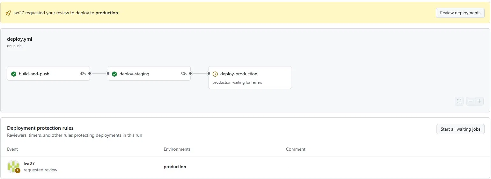
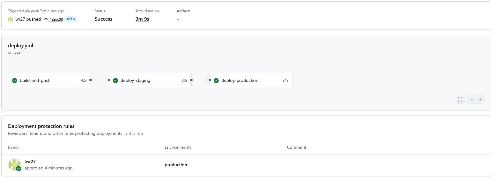
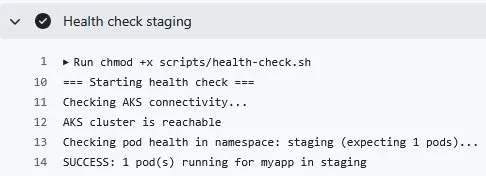
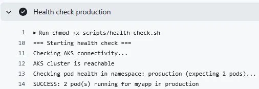
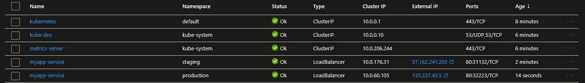
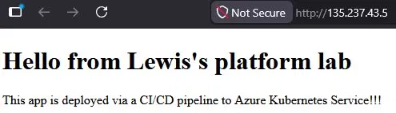
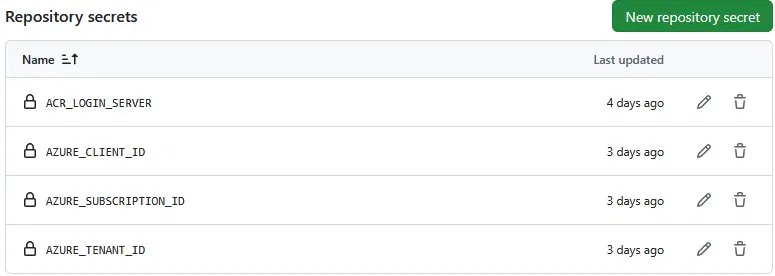
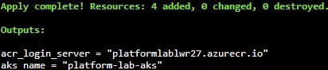
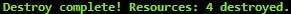

# Lab

Personal home lab built to get hands on with platform engineering concepts.

## What it does

Deploys a web app through a full staging and production pipeline on Azure Kubernetes Service. Infrastructure is provisioned with Terraform and authentication uses OIDC — no stored passwords anywhere.

---

## Pipeline

Push a change to main and this happens automatically:

1. Docker image built and pushed to Azure Container Registry
2. Deployed to staging namespace and health checked
3. Pipeline pauses for manual approval
4. Deployed to production namespace and health checked

<details>
<summary>Pipeline screenshots</summary>





</details>

---

## Infrastructure

Provisioned with Terraform — spin up with one command, tear down with one command.

Resources created:
- Resource Group
- Azure Container Registry
- AKS cluster
- AcrPull role assignment


---

## Environments

Staging and production run as separate Kubernetes namespaces on the same cluster with their own public IPs.

| | Staging | Production |
|--|---------|------------|
| Replicas | 1 | 2 |
| Approval required | No | Yes |
| Resource limits | Yes | Yes |
| Liveness probe | Yes | Yes |
| Readiness probe | Yes | Yes |

<details>
<summary>Environment screenshots</summary>







</details>

---

## Live app

<details>
<summary>App screenshots</summary>



</details>

---

## Auth

Uses OIDC — GitHub and Azure trust each other directly via federated credentials. No passwords, nothing to rotate or expire.

Two federated credentials:
- Scoped to `refs/heads/main` for the build and staging stages
- Scoped to `environment:production` for the production stage

Secrets needed:
- `ACR_LOGIN_SERVER`
- `AZURE_CLIENT_ID`
- `AZURE_TENANT_ID`
- `AZURE_SUBSCRIPTION_ID`

<details>
<summary>Auth screenshots</summary>



</details>

---

## Files

| File | What it does |
|------|-------------|
| `index.html` | The app |
| `Dockerfile` | Builds the image |
| `k8s/staging.yaml` | Kubernetes config for staging — 1 replica, resource limits, probes |
| `k8s/production.yaml` | Kubernetes config for production — 2 replicas, resource limits, probes |
| `.github/workflows/deploy.yml` | Pipeline |
| `terraform/main.tf` | Azure infrastructure |
| `scripts/health-check.sh` | Post-deploy health check — environment aware |

---

## Spin up

```bash
git clone https://github.com/lwr27/lab.git
cd lab/terraform
terraform init
terraform apply
```

Push a change to `index.html` to trigger the pipeline.

<details>
<summary>Terraform apply</summary>



</details>

## Tear down

```bash
terraform destroy
```
<details>
<summary>Terraform destroy</summary>



</details>
